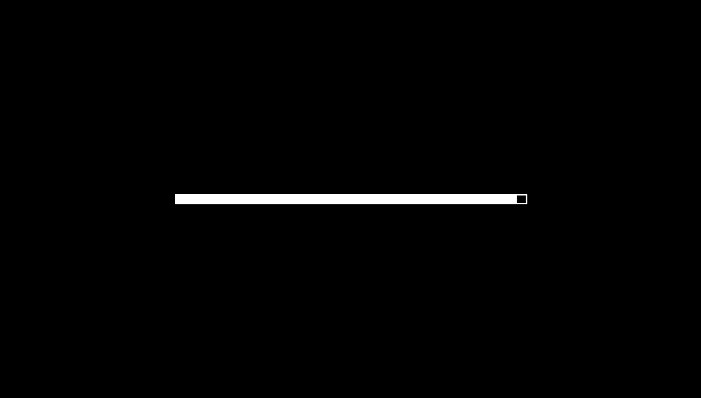
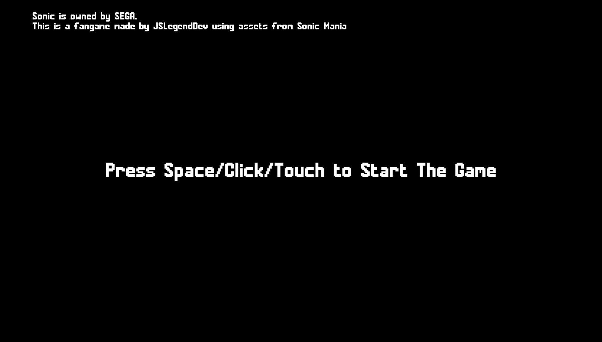
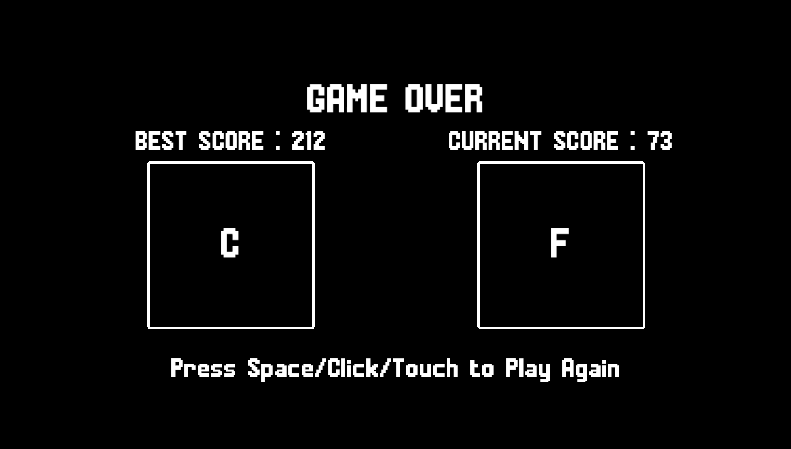

# 📄 DOKUMENTACJA TECHNICZNA PROJEKTU

## 1. Strona tytułowa

**Nazwa uczelni:** Akademia Tarnowska 
**Kierunek:** Informatyka
**Przedmiot:** Projektowanie interfejsów użytkownika 
**Temat projektu:** Gra przeglądarkowa – "Sonic Ring Run"  
**Imię i nazwisko autora:** Nazar Suslyk
**Nr indeksu:** 37735
**Data oddania:** 12.05.2025 
**Prowadzący:** Mateusz Żurowski

---

## 2. Krótki opis aplikacji

**"Sonic Ring Run"** to przeglądarkowa gra platformowa 2D stworzona w technologii JavaScript z wykorzystaniem silnika Kaplay.js. Gracz wciela się w postać Sonica i ma za zadanie zbierać pierścienie oraz unikać przeciwników. Gra oferuje dynamiczny gameplay, rosnący poziom trudności oraz system oceniania wyników (ranking F–S).

---

## 3. Wykorzystana technologia

- **HTML5 + Canvas** (poprzez silnik Kaplay)  
- **JavaScript (ES6)** – logika gry  
- **Kaplay.js** – framework do tworzenia gier 2D  
- **Zasoby graficzne/audio:** sprite'y i dźwięki z gry Sonic Mania (fanart/fangame)  
- **Vite** – szybkie środowisko uruchomieniowe

---

## 4. Sposób uruchomienia

Wymagane jest zainstalowanie **Node.js**.

Projekt należy uruchomić za pomocą **Vite**:

```bash
npm install
npm run dev
```

Strona zostanie uruchomiona pod lokalnym adresem:
**[http://localhost:5173](http://localhost:5173)**

---

## 5. Link do kodu aplikacji

🔗 GitHub repozytorium:
https://github.com/Nazar570/sonnic-runner

---

## 6. Zrzuty z projektu graficznego
Loading page 



Disclaimer Page



Main Menu Page


Gameplay Page


Gameover Pagу


---

## 7. Opis interfejsu użytkownika

### Ekran powitalny:
- **Logo gry:** Na ekranie powitalnym pojawia się logo gry, które jest statycznym elementem tła.
- **Tekst informacyjny:** Tekst informujący o prawach do postaci Sonica oraz o tym, że jest to fangame, np.:
    - „Sonic is owned by SEGA. This is a fangame made by JSLegendDev using assets from Sonic Mania”
    - Wyświetlany na ekranie:
      ```javascript
      k.add([
        k.text(`Sonic is owned by SEGA.\nThis is a fangame made by JSLegendDev using assets from Sonic Mania`, { font: "mania", size: 32 }),
      ]);
      ```
- **Przycisk rozpoczęcia gry:** Gracz może kliknąć spację, kliknąć myszką lub dotknąć ekran, aby rozpocząć grę. Po naciśnięciu przycisku ekran przechodzi do menu głównego.
    - Obsługiwane przez:
      ```javascript
      k.onButtonPress("jump", () => k.go("main-menu"));
      ```

### Menu główne:
- **Animowane tło:** Tło gry jest animowane, pokazujące dynamiczne obrazy tła, np. „chemical-bg” – tło w grze. Tło przesuwa się w czasie gry.
    - Zdefiniowane w kodzie:
      ```javascript
      const bgPieceWidth = 1920;
      const bgPieces = [
        k.add([k.sprite("chemical-bg"), k.pos(0, 0), k.scale(2), k.opacity(0.8)]),
        k.add([k.sprite("chemical-bg"), k.pos(1920, 0), k.scale(2), k.opacity(0.8)]),
      ];
      ```
- **Tytuł gry:** Tytuł gry jest wyświetlany na ekranie głównym.
    - Zdefiniowane w kodzie:
      ```javascript
      k.add([
        k.text("SONIC RING RUN", { font: "mania", size: 96 }),
        k.anchor("center"),
        k.pos(k.center().x, 200),
      ]);
      ```
- **Przycisk „Play”:** Przycisk umożliwiający rozpoczęcie gry. Może to być przycisk „Start” lub opcja uruchomienia gry, wyświetlający tekst „Press Space/Click/Touch to Play”.
    - Zdefiniowane w kodzie:
      ```javascript
      k.add([k.text("Press Space/Click/Touch to Play", { font: "mania", size: 32 }), k.anchor("center"), k.pos(k.center().x, k.center().y - 200)]);
      k.onButtonPress("jump", () => k.go("game"));
      ```
- **Postać Sonica:** Sonic pojawia się na tle menu, będąc częścią animacji w tle. Sonic jest tworzony w funkcji `makeSonic()`.
    - Zdefiniowane w kodzie:
      ```javascript
      makeSonic(k.vec2(200, 745));
      ```

### Ekran gry:
- **Sonic automatycznie porusza się:** Sonic porusza się po ekranie, sterowany przez gracza za pomocą klawisza spacji (do skoku). Gracz może skakać, unikając przeszkód i zbierając pierścienie.
    - Obsługuje to kod:
      ```javascript
      sonic.onCollide("ring", (ring) => {
        k.play("ring", { volume: 0.5 });
        k.destroy(ring);
        score++;
        scoreText.text = `SCORE : ${score}`;
      });
      sonic.onCollide("enemy", (enemy) => {
        if (!sonic.isGrounded() && sonic.isFalling()) {
          k.play("destroy", { volume: 0.5 });
          k.play("hyper-ring", { volume: 0.5 });
          k.destroy(enemy);
          sonic.play("jump");
          sonic.jump();
        }
      });
      ```
- **Platformy i tło:** Platformy, po których Sonic porusza się, są odpowiedzialne za fizykę i ułożenie środowiska.
    - Zdefiniowane w kodzie:
      ```javascript
      const platforms = [
        k.add([k.sprite("platforms"), k.pos(0, 450), k.scale(4)]),
        k.add([k.sprite("platforms"), k.pos(384, 450), k.scale(4)]),
      ];
      if (bgPieces[1].pos.x < 0) {
        bgPieces[0].moveTo(bgPieces[1].pos.x + bgPieceWidth * 2, 0);
        bgPieces.push(bgPieces.shift());
      }
      bgPieces[0].move(-100, 0);
      bgPieces[1].moveTo(bgPieces[0].pos.x + bgPieceWidth * 2, 0);
      ```
- **Obiekty do zbierania (pierścienie):** Gracz może zbierać pierścienie, które pojawiają się na ekranie. Gdy Sonic zbierze pierścień, wynik rośnie.
    - Zdefiniowane w kodzie:
      ```javascript
      sonic.onCollide("ring", (ring) => {
        k.play("ring", { volume: 0.5 });
        k.destroy(ring);
        score++;
        scoreText.text = `SCORE : ${score}`;
      });
      ```
- **Przeciwnicy (Motobug):** Gracz musi unikać przeciwników, takich jak „Motobug”, które pojawiają się na ekranie. Jeśli Sonic zderzy się z przeciwnikiem, może stracić życie.
    - Zdefiniowane w kodzie:
      ```javascript
      const spawnMotoBug = () => {
        const motobug = makeMotobug(k.vec2(1950, 773));
        motobug.onUpdate(() => {
          if (gameSpeed < 3000) {
            motobug.move(-(gameSpeed + 300), 0);
          } else {
            motobug.move(-gameSpeed, 0);
          }
        });
        motobug.onExitScreen(() => {
          if (motobug.pos.x < 0) k.destroy(motobug);
        });
        const waitTime = k.rand(0.5, 2.5);
        k.wait(waitTime, spawnMotoBug);
      };
      ```
- **Wynik:** Gracz zdobywa punkty za każdą zebraną pierścienie, a wynik jest wyświetlany w lewym górnym rogu.
    - Zdefiniowane w kodzie:
      ```javascript
      const scoreText = k.add([k.text("SCORE : 0", { font: "mania", size: 72 }), k.pos(20, 20)]);
      ```

### Ekran Game Over:
- **Tekst końca gry:** Po przegranej wyświetla się komunikat "GAME OVER".
    - Zdefiniowane w kodzie:
      ```javascript
      k.add([k.text("GAME OVER", { font: "mania", size: 96 }), k.anchor("center"), k.pos(k.center().x, k.center().y - 300)]);
      ```
- **Wyniki:** Pokazuje najlepszy wynik oraz aktualny wynik gracza.
    - Zdefiniowane w kodzie:
      ```javascript
      k.add([k.text(`BEST SCORE : ${bestScore}`, { font: "mania", size: 64 }), k.pos(k.center().x - 400, k.center().y - 200)]);
      k.add([k.text(`CURRENT SCORE : ${currentScore}`, { font: "mania", size: 64 }), k.pos(k.center().x + 400, k.center().y - 200)]);
      ```
- **Ranking:** Gracz otrzymuje ocenę za swoją grę w formie literowej (np. A, B, C, itp.), na podstawie zdobytych punktów.
    - Zdefiniowane w kodzie:
      ```javascript
      const bestRankBox = k.add([k.rect(400, 400, { radius: 4 }), k.color(0, 0, 0), k.anchor("center"), k.outline(6, k.Color.fromArray([255, 255, 255]))]);
      bestRankBox.add([k.text(bestRank, { font: "mania", size: 100 }), k.anchor("center")]);
      ```
- **Przycisk ponownego rozpoczęcia gry:** Gracz może ponownie rozpocząć grę klikając spację, myszką lub dotykając ekranu.
    - Zdefiniowane w kodzie:
      ```javascript
      k.add([k.text("Press Space/Click/Touch to Play Again", { font: "mania", size: 64 }), k.anchor("center"), k.pos(k.center().x, k.center().y + 350)]);
      k.onButtonPress("jump", () => k.go("game"));
      ```
